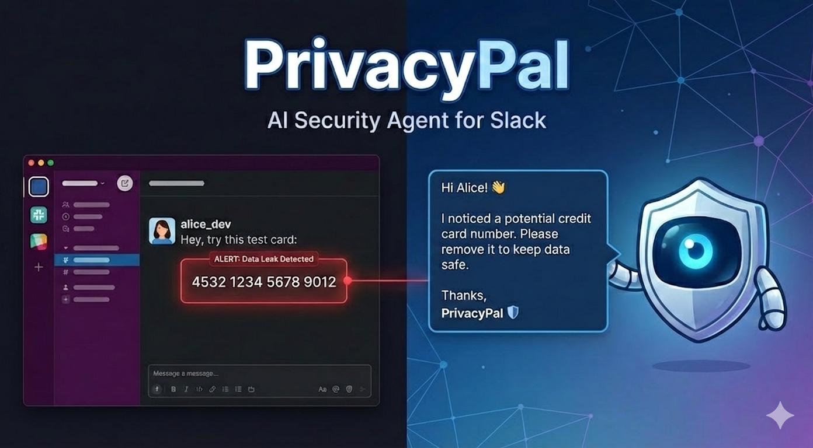
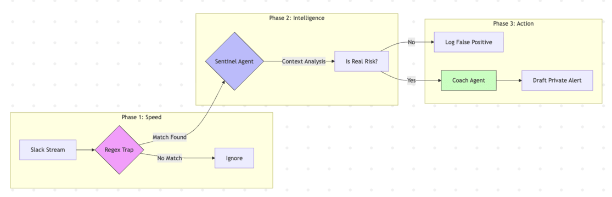

# PrivacyPal: The "Glass-Wall" Security Agent
## **Track:** Enterprise Agents | **Built for:** Kaggle 5-Day AI Agents Intensive



PrivacyPal is an intelligent, privacy-first AI agent designed to fix data leaks before they become lawsuits. It monitors internal communications (simulated Slack/Docs) for sensitive data like API Keys and PII. Unlike traditional "dumb" Regex tools, it uses Gemini 2.0 to understand context, reducing false positives and privately coaching employees instead of punishing them.

## 🚨 The Problem
Companies face a massive risk from "Shadow IT" and accidental copy-pasting. While platforms like Slack and Jira secure the infrastructure, they operate on a Shared Responsibility Model—they cannot control the content users generate.
* **The Risk:** A developer pastes a live AWS key into a public channel, or a support rep shares a Google Doc full of credit card numbers.
* **The Failure:** Traditional DLP (Data Loss Prevention) tools use rigid pattern matching (Regex). They flag every 16-digit number as a credit card (even library cards) and every key pattern as a risk (even dummy keys), creating massive "Alert Fatigue" and a hostile "snitch" culture.
This "human element" is responsible for 74% of data breaches, including the 2022 Uber hack.

## 💡 The Solution: "Filter, Verify, Act" - A Hybrid Agentic Architecture
* **The Trap (Deterministic):** A high-speed Regex scanner flags potential patterns (Cost: $0, Speed: Instant).
* **The Brain (Probabilistic):** A Gemini 2.0 Flash agent analyzes the context of the flagged message. It determines if the data is "Live/Real" or just "Test/Documentation."
* **The Coach (Action):** If verified, the agent sends a private, ephemeral message to the user, explaining the risk and asking for remediation.


## 🛠️ Tech Stack & Tools Used
**I built this project to demonstrate **Agentic Tool Use** and **Sequential Logic**.

* **Core AI:** Google Gemini 2.0 Flash (via `google-generativeai`)
* **Agent Framework:** Google Agent Development Kit (ADK) for Python.
* **Tooling:** Custom Python tools (`submit_verdict`, `send_notification`) bound to the LLM.
* **Observability:** `colorama` for real-time terminal logging.
* **Data Simulation:** JSON-based mock Slack feed.

## 🚀 Setup & Installation

Follow these steps to get the agent running locally.

### 1. Clone the Repository
```bash
git clone https://github.com/YOUR_USERNAME/PrivacyPal.git
cd PrivacyPal
```

### 2. Set Up Virtual Environment
It is recommended to use a virtual environment to manage dependencies.
```bash
python3.11 -m venv venv
source venv/bin/activate
```

### 3. Install Dependencies
```bash
pip install -r requirements.txt
```

### 4. Configure Environment Variables
Create a file named .env in the root directory. Add your Google Gemini API key to it:
```ini
GOOGLE_API_KEY=your_actual_api_key_here
```

### 5. Verify Installation
Run the agent to ensure everything is connected:
```Bash
python main.py
```

### 6. Usage
Run the Agent: Start the simulation loop to watch PrivacyPal process the mock Slack feed in real-time.
```Bash
python main.py
```

What you will see: The terminal will display the live decision log.
* ✅ Green: False Positives (Safe data found and ignored).
* 🔴 Red: Real Risks (Sensitive data found and verified).
* 🟣 Purple: The "Coach" agent drafting and sending a private alert.